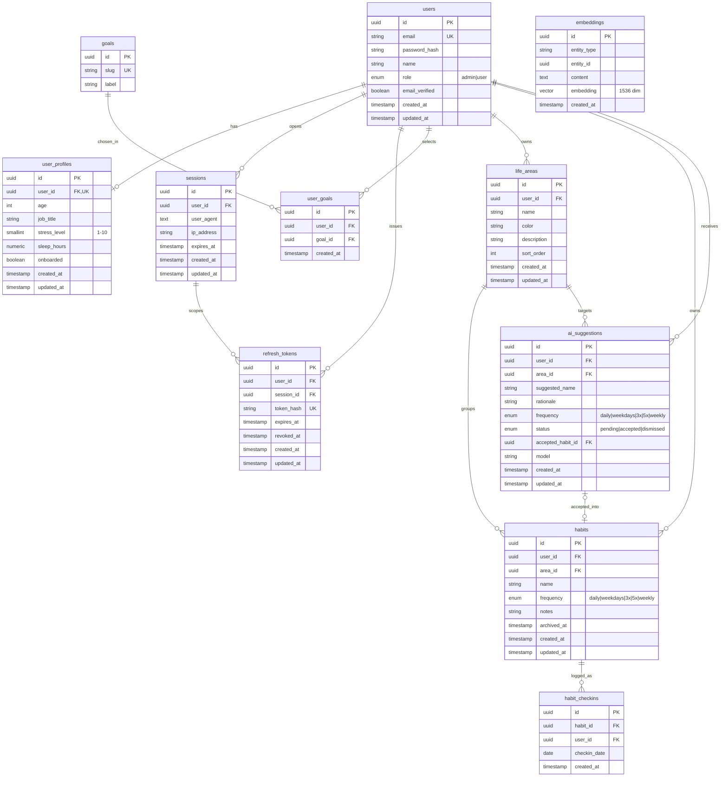

# KULTIVAR / LifePulse — Entity Relationship Diagram

Production-ready data model for the full product: authentication, user profile &
goals, life areas, habits, daily check-ins, and the AI suggestion / embedding
layer.

> How to view this diagram
>
> - It renders automatically on GitHub and in the Cursor / VS Code Markdown
>   preview.
> - To export a drawn image (PNG/SVG) to show colleagues, copy the `mermaid`
>   block below into <https://mermaid.live> and use **Actions → Export**.

## Legend

- **Already built** (live in the database today, do not modify the schema):
  `users`, `sessions`, `refresh_tokens` — see
  [`packages/api/src/migrations/20240101000000-create-auth-tables.js`](../packages/api/src/migrations/20240101000000-create-auth-tables.js).
  Login already works end-to-end.
- **To build** (everything that hangs off `users`): `user_profiles`, `goals`,
  `user_goals`, `life_areas`, `habits`, `habit_checkins`, `ai_suggestions`,
  `embeddings`.

The only change touching the existing tables is new foreign keys pointing at
`users.id`. Nothing about `users` / `sessions` / `refresh_tokens` itself changes.

## Diagram

## Entity notes

### Already built

| Table | Purpose | Key constraints |
|-------|---------|-----------------|
| `users` | Account + auth identity | `email` unique; `role` enum `admin\|user`; UUID PK via `gen_random_uuid()` |
| `sessions` | One row per active login | `user_id` FK → `users` `ON DELETE CASCADE` |
| `refresh_tokens` | Rotating refresh tokens | `token_hash` unique; FKs to `users` and `sessions`, both `ON DELETE CASCADE` |

### To build — core domain

| Table | Purpose | Key constraints |
|-------|---------|-----------------|
| `user_profiles` | 1:1 extension of `users` with onboarding/wellbeing data (age, job title, stress 1-10, sleep hours, onboarded flag) | `user_id` FK **unique** (enforces 1:1); `ON DELETE CASCADE` |
| `goals` | Catalog of selectable goals (e.g. "Focus & Clarity", "Better Sleep") | `slug` unique; seeded reference data, shared across users |
| `user_goals` | M:N join — which goals a user picked | unique `(user_id, goal_id)`; both FKs `ON DELETE CASCADE` |
| `life_areas` | A user's life domains (Health, Career, Mind, …) | `user_id` FK `ON DELETE CASCADE`; `color` matches frontend area tokens; `sort_order` for display |
| `habits` | Habits grouped under a life area | FKs `user_id` + `area_id` (→ `life_areas`) `ON DELETE CASCADE`; `frequency` enum `daily\|weekdays\|3x\|5x\|weekly`; `archived_at` for soft delete |
| `habit_checkins` | One row per completed habit per day | unique `(habit_id, checkin_date)` (one check per day); FKs `ON DELETE CASCADE`; `user_id` denormalized for fast per-user queries |

### To build — AI layer

| Table | Purpose | Key constraints |
|-------|---------|-----------------|
| `ai_suggestions` | AI-generated habit suggestions per area (3-5 per area) with accept/dismiss workflow | FKs `user_id` + `area_id`; `status` enum `pending\|accepted\|dismissed`; `accepted_habit_id` FK → `habits` (nullable, set when accepted); `model` records which model produced it |
| `embeddings` | Vector store for semantic search / habit de-duplication | requires the `pgvector` extension; `embedding vector(1536)` (matches `text-embedding-3-small`); index on `(entity_type, entity_id)`; backs the `embeddings` BullMQ queue |

## Conventions

- All primary keys are `uuid` defaulting to `gen_random_uuid()`, consistent with
  the existing auth tables.
- All tables carry `created_at` / `updated_at` timestamps (Sequelize
  `timestamps: true`, `underscored: true`), except join/log rows that only need
  `created_at`.
- Every child table cascades on delete from its parent so removing a user (or an
  area, or a habit) cleans up dependent rows.
- `embeddings` needs `CREATE EXTENSION IF NOT EXISTS vector;` in its migration.
