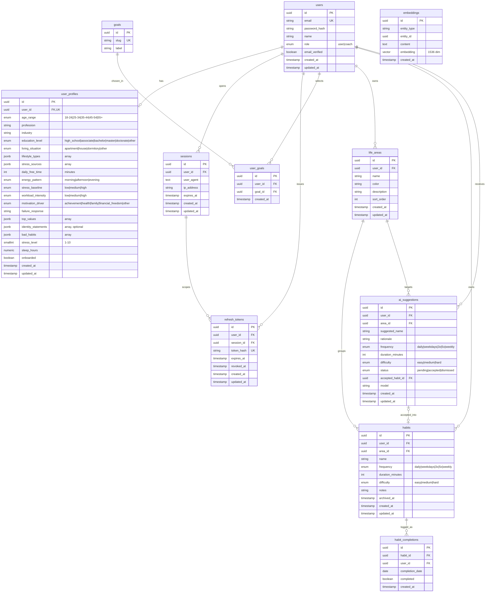

# KULTIVAR / LifePulse — Entity Relationship Diagram

Production-ready data model for the full product: authentication, user profile &
goals, life areas, habits, daily check-ins, and the AI suggestion / embedding
layer.

> How to view this diagram
>
> - It renders automatically on GitHub and in the Cursor / VS Code Markdown
>   preview.
> - To export a drawn image (PNG/SVG) to show colleagues, copy the `mermaid`
>   block below into <https://mermaid.live> and use **Actions → Export**.

## Legend

- **Already built** (live in the database today, do not modify the schema):
  `users`, `sessions`, `refresh_tokens` — see
  [`packages/api/src/migrations/20240101000000-create-auth-tables.js`](../packages/api/src/migrations/20240101000000-create-auth-tables.js).
  Login already works end-to-end.
- **To build** (everything that hangs off `users`): `user_profiles`, `goals`,
  `user_goals`, `life_areas`, `habits`, `habit_completions`, `ai_suggestions`,
  `embeddings`.

The only change touching the existing tables is new foreign keys pointing at
`users.id`. Nothing about `users` / `sessions` / `refresh_tokens` itself changes.

## Diagram

```mermaid
erDiagram
    users ||--o| user_profiles : has
    users ||--o{ sessions : opens
    users ||--o{ refresh_tokens : issues
    sessions ||--o{ refresh_tokens : scopes
    users ||--o{ user_goals : selects
    goals ||--o{ user_goals : chosen_in
    users ||--o{ life_areas : owns
    life_areas ||--o{ habits : groups
    users ||--o{ habits : owns
    habits ||--o{ habit_completions : logged_as
    users ||--o{ ai_suggestions : receives
    life_areas ||--o{ ai_suggestions : targets
    ai_suggestions |o--o| habits : accepted_into

    users {
        uuid id PK
        string email UK
        string password_hash
        string name
        enum role "user|coach"
        boolean email_verified
        timestamp created_at
        timestamp updated_at
    }
    user_profiles {
        uuid id PK
        uuid user_id FK,UK
        enum age_range "18-24|25-34|35-44|45-54|55+"
        string profession
        string industry
        enum education_level "high_school|associate|bachelor|master|doctorate|other"
        enum living_situation "apartment|house|dormitory|other"
        jsonb lifestyle_types "array"
        jsonb stress_sources "array"
        int daily_free_time "minutes"
        enum energy_pattern "morning|afternoon|evening"
        enum stress_baseline "low|medium|high"
        enum workload_intensity "low|medium|high"
        enum motivation_driver "achievement|health|family|financial_freedom|other"
        string failure_response
        jsonb top_values "array"
        jsonb identity_statements "array, optional"
        jsonb bad_habits "array"
        smallint stress_level "1-10"
        numeric sleep_hours
        boolean onboarded
        timestamp created_at
        timestamp updated_at
    }
    goals {
        uuid id PK
        string slug UK
        string label
    }
    user_goals {
        uuid id PK
        uuid user_id FK
        uuid goal_id FK
        timestamp created_at
    }
    life_areas {
        uuid id PK
        uuid user_id FK
        string name
        string color
        string description
        int sort_order
        timestamp created_at
        timestamp updated_at
    }
    habits {
        uuid id PK
        uuid user_id FK
        uuid area_id FK
        string name
        enum frequency "daily|weekdays|3x|5x|weekly"
        int duration_minutes
        enum difficulty "easy|medium|hard"
        string notes
        timestamp archived_at
        timestamp created_at
        timestamp updated_at
    }
    habit_completions {
        uuid id PK
        uuid habit_id FK
        uuid user_id FK
        date completion_date
        boolean completed
        timestamp created_at
    }
    ai_suggestions {
        uuid id PK
        uuid user_id FK
        uuid area_id FK
        string suggested_name
        string rationale
        enum frequency "daily|weekdays|3x|5x|weekly"
        int duration_minutes
        enum difficulty "easy|medium|hard"
        enum status "pending|accepted|dismissed"
        uuid accepted_habit_id FK
        string model
        timestamp created_at
        timestamp updated_at
    }
    embeddings {
        uuid id PK
        string entity_type
        uuid entity_id
        text content
        vector embedding "1536 dim"
        timestamp created_at
    }
    sessions {
        uuid id PK
        uuid user_id FK
        text user_agent
        string ip_address
        timestamp expires_at
        timestamp created_at
        timestamp updated_at
    }
    refresh_tokens {
        uuid id PK
        uuid user_id FK
        uuid session_id FK
        string token_hash UK
        timestamp expires_at
        timestamp revoked_at
        timestamp created_at
        timestamp updated_at
    }
```

## Entity notes

### Already built

| Table | Purpose | Key constraints |
|-------|---------|-----------------|
| `users` | Account + auth identity | `email` unique; `role` enum `user\|coach`; UUID PK via `gen_random_uuid()` |
| `sessions` | One row per active login | `user_id` FK → `users` `ON DELETE CASCADE` |
| `refresh_tokens` | Rotating refresh tokens | `token_hash` unique; FKs to `users` and `sessions`, both `ON DELETE CASCADE` |

### To build — core domain

| Table | Purpose | Key constraints |
|-------|---------|-----------------|
| `user_profiles` | 1:1 extension of `users` with rich onboarding / AI context (demographics, lifestyle, stress, motivation, values, identity statements, bad habits) plus wellbeing data (stress 1-10, sleep hours, onboarded flag). Collected during onboarding; editable from Profile after onboarding. | `user_id` FK **unique** (enforces 1:1); `ON DELETE CASCADE`; array fields stored as `jsonb` |
| `goals` | Catalog of selectable goals (e.g. "Focus & Clarity", "Better Sleep") | `slug` unique; seeded reference data, shared across users |
| `user_goals` | M:N join — which goals a user picked | unique `(user_id, goal_id)`; both FKs `ON DELETE CASCADE` |
| `life_areas` | A user's life domains (Health, Career, Mind, …) | `user_id` FK `ON DELETE CASCADE`; `color` matches frontend area tokens; `sort_order` for display |
| `habits` | Habits grouped under a life area | FKs `user_id` + `area_id` (→ `life_areas`) `ON DELETE CASCADE`; `frequency` enum `daily\|weekdays\|3x\|5x\|weekly`; `duration_minutes` estimated time per session; `difficulty` enum `easy\|medium\|hard`; `archived_at` for soft delete. Completion is **not** stored on this table — see `habit_completions`. |
| `habit_completions` | Daily habit log — one row per habit per date (completed or missed) | unique `(habit_id, completion_date)`; FKs `ON DELETE CASCADE`; `user_id` denormalized for fast per-user queries; `completed` boolean enables streaks, historical insights, and AI consistency analysis |

### Coaching

A `coach` account is the second half of the product: it has no life areas or
habits of its own, only a public listing and whatever its clients grant it.
There is no verification state anywhere here — approving coaches needed an
admin, that role no longer exists, and credentials are shown to users as
self-reported instead.

| Table | Purpose | Key constraints |
|-------|---------|-----------------|
| `coach_profiles` | A coach's public directory listing (display name, coaching title, bio, specialties, years of experience). Created with the account at registration. | `user_id` FK **unique** (1:1 with a `role = 'coach'` user) `ON DELETE CASCADE`; `specialties` stored as `jsonb` |
| `coach_credentials` | Qualifications a coach lists on their own profile | `coach_profile_id` FK `ON DELETE CASCADE`; self-reported, no verification flag |
| `coach_client_requests` | A user's invitation to a coach **and** the permission grant attached to it — `share_habits`, `share_profile` and `edit_habits` are set by the user and editable or revocable by them at any time | unique `(requester_id, coach_id)`; both FKs → `users` `ON DELETE CASCADE`; `status` enum `pending|accepted|declined`. `edit_habits` is only ever true alongside `share_habits`, enforced in both the schemas and the service. Access is read at request time, so narrowing a grant takes effect immediately |
| `coach_feedback` | The thread between a coach and their client: notes the coach wrote, plus a record of every habit change the coach made | `coach_request_id` FK `ON DELETE CASCADE` (revoking a request deletes the thread with it); `kind` enum `note|habit_change`, where `habit_change` rows are written by the API itself so a client is never surprised by an edited plan; `created_at` only — entries aren't edited |

### To build — AI layer

| Table | Purpose | Key constraints |
|-------|---------|-----------------|
| `ai_suggestions` | AI-generated habit suggestions per area (3-5 per area) with accept/dismiss workflow | FKs `user_id` + `area_id`; `duration_minutes` + `difficulty` carried into `habits` on accept; `status` enum `pending\|accepted\|dismissed`; `accepted_habit_id` FK → `habits` (nullable, set when accepted); `model` records which model produced it |
| `embeddings` | Vector store for semantic search / habit de-duplication | requires the `pgvector` extension; `embedding vector(1536)` (matches `text-embedding-3-small`); index on `(entity_type, entity_id)`; backs the `embeddings` BullMQ queue |

### `user_profiles` — AI context fields

Collected during onboarding and editable from the Profile page. Richer profiles
improve AI habit recommendations.

| Field | Type | Examples / notes |
|-------|------|------------------|
| `stress_sources` | `jsonb` array | work deadlines, financial pressure, family responsibilities |
| `living_situation` | enum | apartment, house, dormitory |
| `lifestyle_types` | `jsonb` array | working professional, student, parent, entrepreneur |
| `profession` | string | e.g. Software Engineer |
| `industry` | string | e.g. Technology, Healthcare |
| `education_level` | enum | high school, associate, bachelor, master, doctorate |
| `daily_free_time` | int (minutes) | available time for habits per day |
| `age_range` | enum | 18-24, 25-34, 35-44, 45-54, 55+ |
| `energy_pattern` | enum | morning, afternoon, evening |
| `stress_baseline` | enum | low, medium, high |
| `workload_intensity` | enum | low, medium, high |
| `motivation_driver` | enum | achievement, health, family, financial freedom |
| `failure_response` | string | how the user reacts after missing goals or habits |
| `top_values` | `jsonb` array | Growth, Health, Discipline, Family |
| `identity_statements` | `jsonb` array (optional) | "I want to become a healthier person." |
| `bad_habits` | `jsonb` array | too much screen time, procrastination, unhealthy eating |

**UI rule:** when the sum of active habits' `duration_minutes` exceeds the
user's `daily_free_time`, show a schedule warning (does not block saving).

### `habit_completions` vs `habits`

Completion state lives only in `habit_completions`, not on `habits`. This
supports daily progress, streaks, historical insights, and AI analysis of
consistency for adapting future recommendations.

## Conventions

- All primary keys are `uuid` defaulting to `gen_random_uuid()`, consistent with
  the existing auth tables.
- All tables carry `created_at` / `updated_at` timestamps (Sequelize
  `timestamps: true`, `underscored: true`), except join/log rows that only need
  `created_at`.
- Every child table cascades on delete from its parent so removing a user (or an
  area, or a habit) cleans up dependent rows.
- `embeddings` needs `CREATE EXTENSION IF NOT EXISTS vector;` in its migration.
